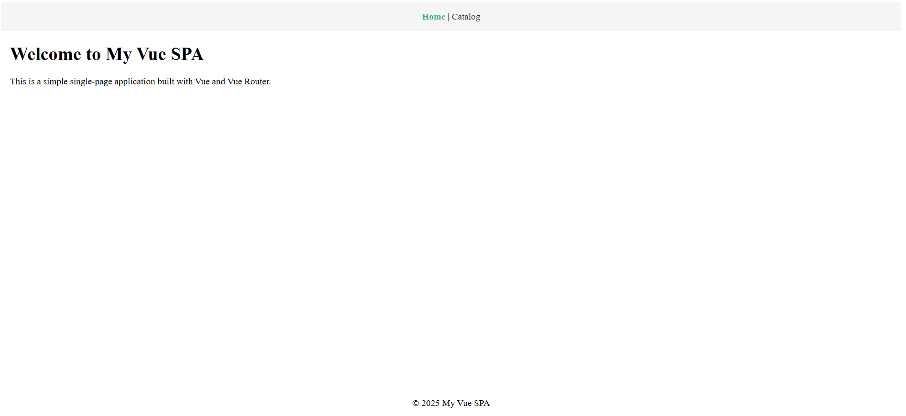
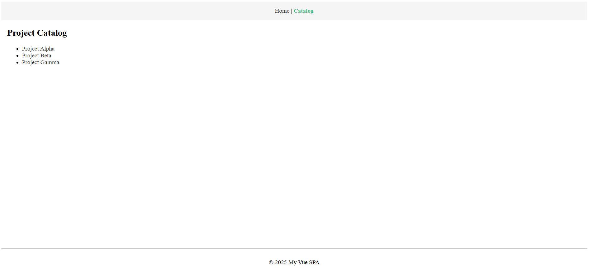
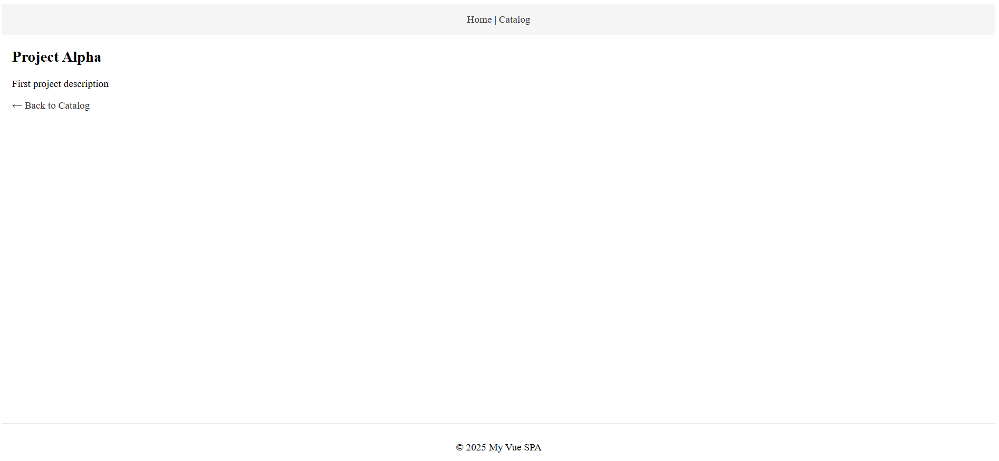

# web-app

A simple single-page application built with Vue 3 and Vue Router.

## Pages

- **Home** – short description of the app.
- **Catalog** – list of projects loaded from `/public/data.json`.
- **Details** – detailed view of a selected item.

## Get started

Clone the repo:

```bash
git clone https://github.com/extremum9/web-app.git
```

Install dependencies:

```bash
npm i
```

Run the development server:

```bash
npm run dev
```

Build the project:

```bash
npm run build
```

Preview the production build:

```bash
npm run preview
```

## Screenshots

### Home page



### Catalog page



### Details page


